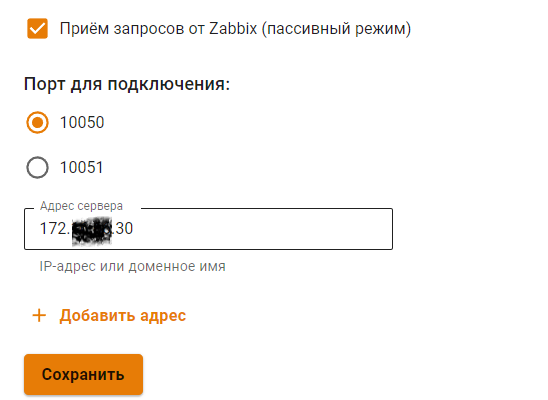
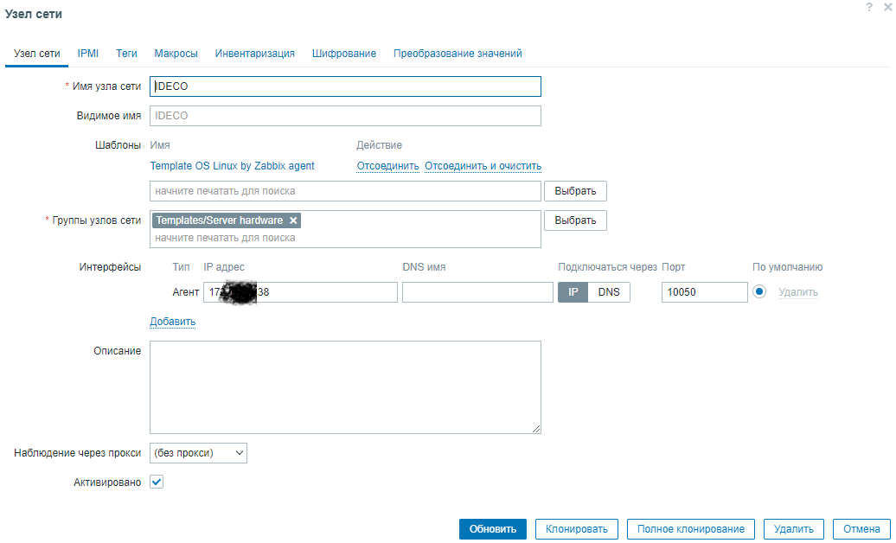
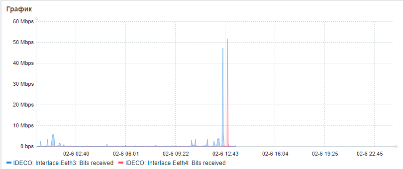
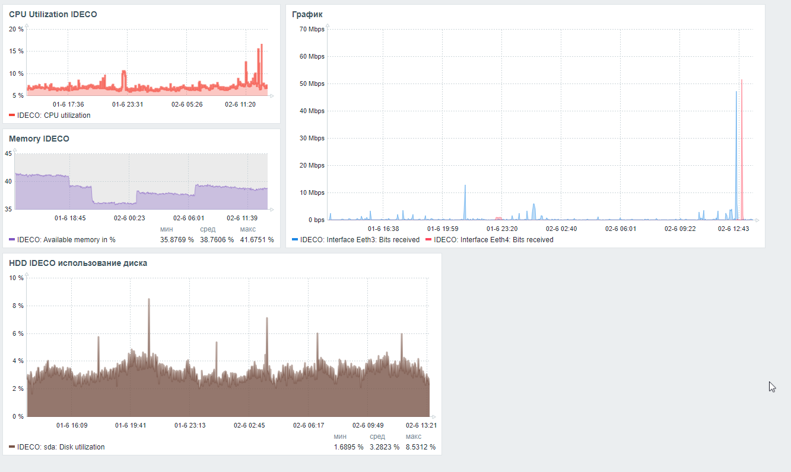

# ZABBIX
Курс OTUS
1. Настраиваем даш-борд для NGWF IDECO. (Т.к. сделана большая работа по настройке IDECO - используется в кластере + 2 провайдера, выполняет функции межсетевого экрана между VLAN в компании- цепочка forward около 90 правил. блокировка по гео IP и dnat и snat.) ресурс важный, поэтому начнем настраивать дашборд, который пригодится в работе.
2. IDECO использует ядро Linux 6.3.8 - в нашей верси. Можно установить ZABBIX агент как в инструкции на сайте ZABBIX, В нашем случае мы его активируем и пропишем IP адрес сервера.
3.  
4.  На сервере ZABBIX - Сбор данных- узды сети. Создаем наш хост. IP агента, группы узлов, шаблоны....
5.  
6.  Далее создаем дашборд и в нем создаем графики память, процессор, диск, сеть.
7.  Для графика сети, выбрал 2 физ. интерфейса, Eeth3 и Eeth4.  Eeth3 - основной провайдер, поэтому он всегда активен, в случае неработоспособности канала связи автоматом работать начнет второй провайдер Eeth4. на графике показано, что появился красный пик активности второго провайдера, это искусственно сделал я. Начал загружать ISO образ из интернета и выключил первого провайдера.
8.  
9.  Далее скрин всего дашборда. 
10.  
